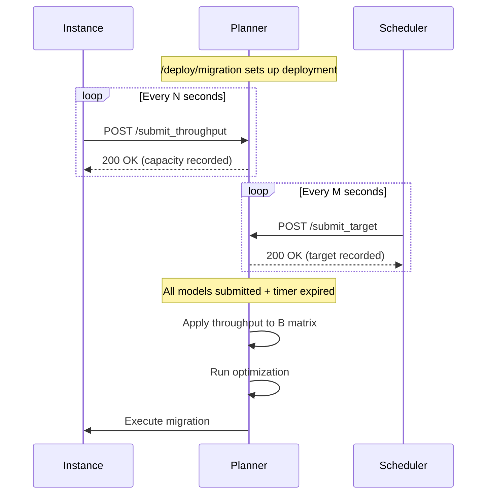

# Submit Throughput Endpoint

## Overview

The `/submit_throughput` endpoint allows instances to report their observed processing performance (average execution time). This data is used to dynamically update the B matrix (processing capacity matrix) for more accurate optimization during auto-reconfiguration.

## API Reference

### POST /submit_throughput

Submit throughput data from an instance to update the B matrix.

#### Request Body

| Field | Type | Required | Description |
|-------|------|----------|-------------|
| `instance_url` | string | Yes | Instance endpoint URL (e.g., `http://localhost:8210`) |
| `avg_execution_time` | float | Yes | Average task execution time in seconds (must be > 0) |

#### Response

| Field | Type | Description |
|-------|------|-------------|
| `success` | bool | Whether data was recorded successfully |
| `message` | string | Status message |
| `instance_url` | string | The instance URL that was submitted |
| `model_id` | string | Model ID determined from instance's current deployment (null if not found) |
| `computed_capacity` | float | Calculated processing capacity (1 / avg_execution_time) |

#### Status Codes

| Code | Description |
|------|-------------|
| 200 | Success - throughput data recorded |
| 422 | Validation error - invalid input (e.g., avg_execution_time <= 0) |

## Usage Example

### Basic Request

```bash
curl -X POST http://planner:8000/submit_throughput \
  -H "Content-Type: application/json" \
  -d '{
    "instance_url": "http://instance-1:8080",
    "avg_execution_time": 0.5
  }'
```

### Response (Instance Found)

```json
{
  "success": true,
  "message": "Throughput recorded for model_a on http://instance-1:8080",
  "instance_url": "http://instance-1:8080",
  "model_id": "model_a",
  "computed_capacity": 2.0
}
```

### Response (Instance Not Found)

When the instance URL is not in the current deployment state:

```json
{
  "success": true,
  "message": "Instance http://unknown:8080 not found in current deployment. Data stored for future use.",
  "instance_url": "http://unknown:8080",
  "model_id": null,
  "computed_capacity": 2.0
}
```

## B Matrix Update Logic

### Processing Capacity Calculation

The processing capacity is calculated as the inverse of the average execution time:

```
capacity = 1 / avg_execution_time
```

For example:
- `avg_execution_time = 0.5s` → `capacity = 2.0 tasks/second`
- `avg_execution_time = 2.0s` → `capacity = 0.5 tasks/second`

### Model Detection

The model ID is automatically determined by looking up the instance's current deployment state:

1. Find the instance in `_stored_deployment_input.instances` by matching `endpoint`
2. Get the `current_model` field from the matched instance
3. If not found, data is still stored for future use

### Multiple Submissions (Exponential Moving Average)

When the same instance submits multiple throughput values, an Exponential Moving Average (EMA) is used to smooth the updates:

```
new_capacity = alpha * submitted_capacity + (1 - alpha) * previous_capacity
```

Where `alpha = 0.3` by default.

This approach:
- Favors recent data while maintaining stability
- Handles bursty workload patterns
- Prevents outliers from causing dramatic B matrix changes

### When B Matrix is Updated

The B matrix is updated **at the start of each auto-reconfiguration cycle**:

1. Auto-optimization triggers (via `/submit_target` data collection)
2. Before running the optimizer, `_apply_throughput_to_b_matrix()` is called
3. For each instance with throughput data:
   - Find the instance index `i` in the deployment
   - Find the model index `j` from the model mapping
   - Update `B[i][j]` with the collected capacity

## Data Storage

- Throughput data is stored **in-memory only**
- Data is lost when the service restarts
- After restart, the original B matrix from the deployment input is used

### Storage Structure

```python
_throughput_data = {
    "http://inst1:8080": {"model_a": 2.0},
    "http://inst2:8080": {"model_b": 1.5},
    "http://inst3:8080": {"model_c": 0.8}
}
```

## Integration with Auto-Reconfiguration

### Workflow

1. **Deploy**: Call `/deploy/migration` to set up initial deployment
2. **Collect Throughput**: Instances periodically call `/submit_throughput` with their observed execution times
3. **Collect Targets**: Schedulers call `/submit_target` with queue lengths
4. **Auto-Optimize**: When all models have submitted targets and the timer expires:
   - Apply throughput data to B matrix
   - Run optimization with updated B matrix
   - Execute migration to new deployment

### Example Sequence



## Error Handling

| Error Case | Behavior |
|------------|----------|
| `avg_execution_time <= 0` | Return 422 validation error |
| `avg_execution_time` missing | Return 422 validation error |
| `instance_url` missing | Return 422 validation error |
| Instance not in deployment | Return 200 with warning, store data anyway |
| No deployment exists | Return 200 with warning, store data for future use |

## Related Endpoints

- `POST /deploy/migration` - Initial deployment setup
- `POST /submit_target` - Submit queue length for auto-optimization
- `GET /timeline` - View migration history with scores
