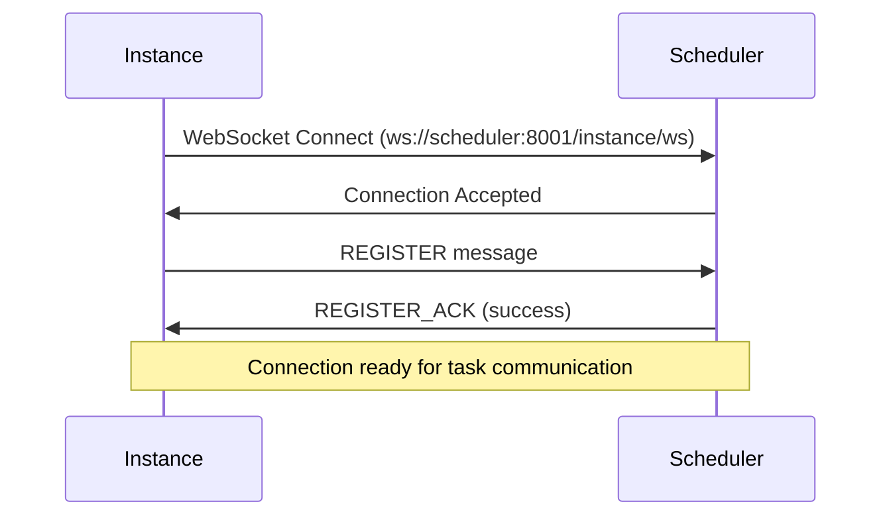
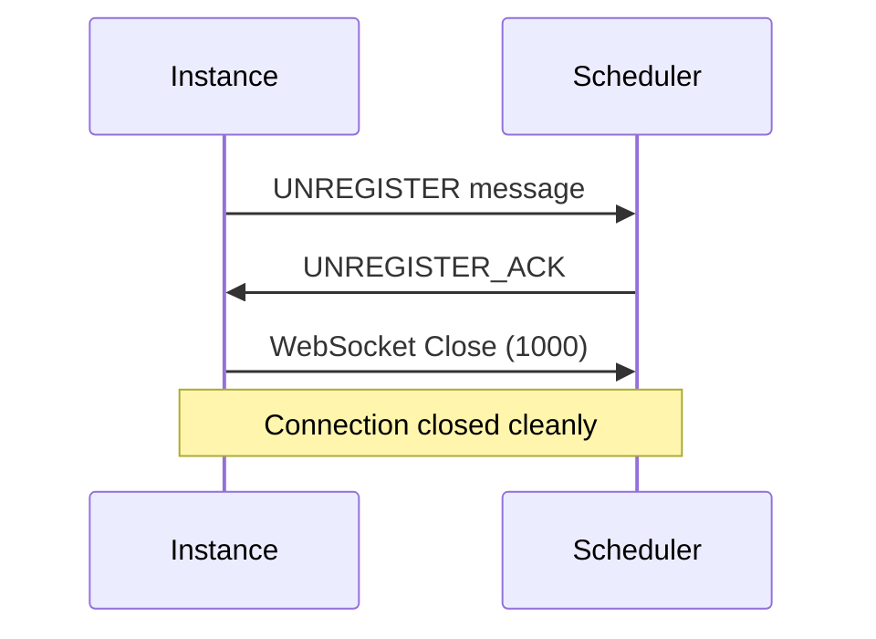
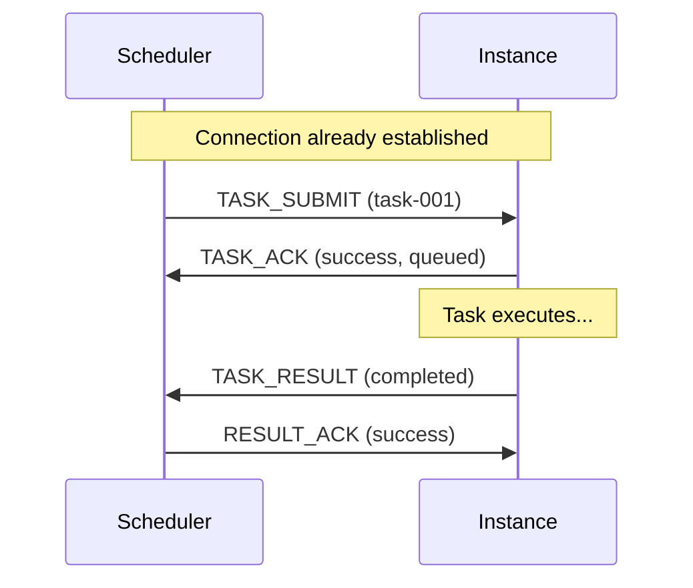
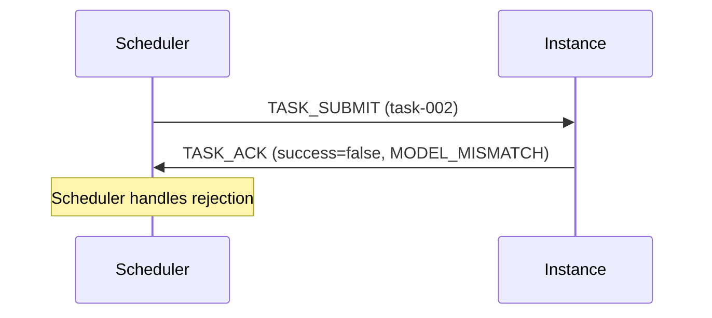
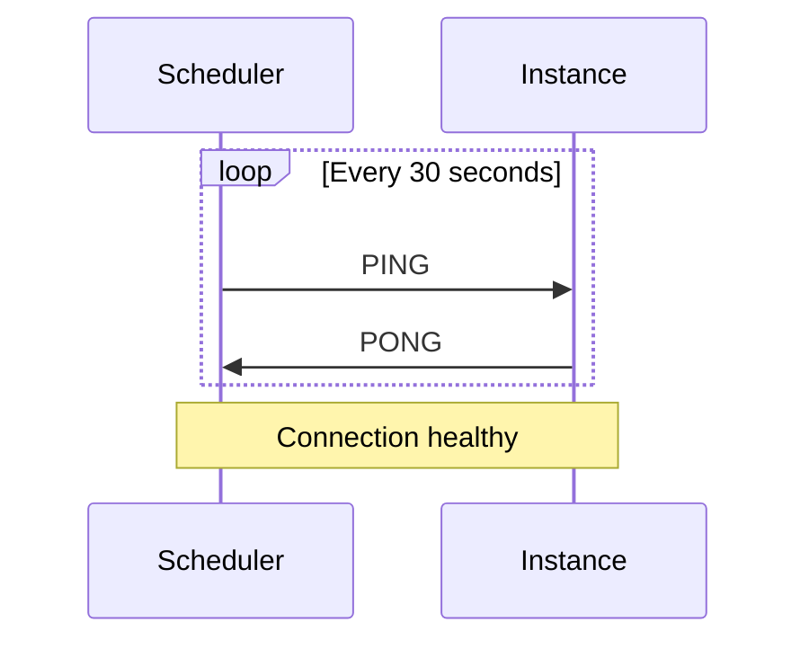
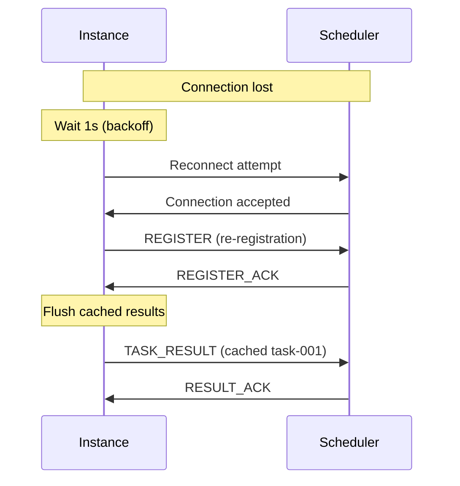

# Instance WebSocket Protocol Specification

> **Version**: 1.0.0
> **Status**: Draft
> **Last Updated**: 2025-11-06

This document specifies the WebSocket communication protocol between Scheduler and Instance services for task submission and result callbacks.

---

## Table of Contents

- [Overview](#overview)
- [Connection Lifecycle](#connection-lifecycle)
- [Message Format](#message-format)
- [Message Types](#message-types)
- [Message Flows](#message-flows)
- [Error Handling](#error-handling)
- [Connection States](#connection-states)
- [Implementation Notes](#implementation-notes)

---

## Overview

### Purpose

Replace HTTP-based communication between Scheduler and Instance with WebSocket to enable:
- Persistent bidirectional communication
- Lower latency for task submission and results
- Simplified connection management
- Reduced connection overhead

### Scope

This protocol covers:
- Instance registration with Scheduler
- Task submission from Scheduler to Instance
- Task result callbacks from Instance to Scheduler
- Connection health monitoring (heartbeat)
- Graceful disconnection

**Out of Scope**: Client-to-Scheduler WebSocket (already implemented in `/task/get_result`)

### Key Principles

- **Message-based**: All communication uses structured JSON messages
- **Asynchronous**: Non-blocking message processing
- **Reliable**: ACK mechanism for important operations
- **Stateful**: Maintains connection state and subscriptions
- **Recoverable**: Automatic reconnection with exponential backoff

---

## Connection Lifecycle

### Connection Establishment



**WebSocket Endpoint**: `ws://scheduler:8001/instance/ws`

**Steps**:
1. Instance establishes WebSocket connection to Scheduler
2. Scheduler accepts connection
3. Instance sends REGISTER message with instance details
4. Scheduler validates and registers instance
5. Scheduler sends REGISTER_ACK confirmation
6. Connection is ready for bidirectional communication

### Connection Maintenance

**Heartbeat Mechanism**:
- Scheduler sends PING every 30 seconds
- Instance responds with PONG within 5 seconds
- Missing 3 consecutive PONGs triggers disconnection

**Idle Timeout**:
- No timeout on idle connections (maintained by heartbeat)

### Connection Termination

**Graceful Shutdown**:


**Unexpected Disconnection**:
- Scheduler detects via heartbeat timeout
- Instance marked as DISCONNECTED
- No new tasks assigned
- Instance attempts reconnection

---

## Message Format

### Base Message Structure

All messages follow this JSON schema:

```json
{
  "type": "MESSAGE_TYPE",
  "message_id": "uuid-v4",
  "timestamp": "ISO8601 UTC timestamp",
  ...type-specific fields
}
```

**Common Fields**:
- `type` (string, required): Message type identifier
- `message_id` (string, required): Unique message identifier (UUID v4)
- `timestamp` (string, required): ISO 8601 UTC timestamp with milliseconds

**Message Size Limit**: 16 MB (configurable)

### Acknowledgment Messages

ACK messages include a `reply_to` field referencing the original message:

```json
{
  "type": "MESSAGE_TYPE_ACK",
  "message_id": "new-uuid",
  "reply_to": "original-message-id",
  "success": true,
  "timestamp": "ISO8601"
}
```

---

## Message Types

### 1. REGISTER (Instance → Scheduler)

**Purpose**: Register Instance with Scheduler

**Schema**:
```json
{
  "type": "register",
  "message_id": "uuid",
  "timestamp": "2025-11-06T12:34:56.789Z",
  "instance_id": "instance-gpu-0",
  "model_id": "easyocr/dec",
  "endpoint": "ws://192.168.1.100:8300/ws",
  "platform_info": {
    "software_name": "docker",
    "software_version": "20.10",
    "hardware_name": "nvidia-rtx-3090"
  }
}
```

**Fields**:
- `instance_id` (string, required): Unique instance identifier
- `model_id` (string, required): Model being served
- `endpoint` (string, required): Instance WebSocket endpoint (for reference)
- `platform_info` (object, required): Platform information
  - `software_name` (string, required)
  - `software_version` (string, required)
  - `hardware_name` (string, required)

**Response**: REGISTER_ACK

---

### 2. REGISTER_ACK (Scheduler → Instance)

**Purpose**: Confirm registration success/failure

**Schema**:
```json
{
  "type": "register_ack",
  "message_id": "uuid",
  "reply_to": "original-register-message-id",
  "timestamp": "2025-11-06T12:34:56.790Z",
  "success": true,
  "message": "Instance registered successfully"
}
```

**Fields**:
- `reply_to` (string, required): Original REGISTER message_id
- `success` (boolean, required): Registration result
- `message` (string, required): Human-readable status message

**Error Response**:
```json
{
  "type": "register_ack",
  "message_id": "uuid",
  "reply_to": "original-message-id",
  "timestamp": "2025-11-06T12:34:56.790Z",
  "success": false,
  "message": "Instance with this ID already exists",
  "error_code": "DUPLICATE_INSTANCE"
}
```

---

### 3. TASK_SUBMIT (Scheduler → Instance)

**Purpose**: Submit task for execution

**Schema**:
```json
{
  "type": "task_submit",
  "message_id": "uuid",
  "timestamp": "2025-11-06T12:35:00.123Z",
  "task_id": "task-001",
  "model_id": "easyocr/dec",
  "task_input": {
    "image": "base64_encoded_data",
    "language": "en"
  },
  "metadata": {
    "height": 512,
    "width": 512
  }
}
```

**Fields**:
- `task_id` (string, required): Unique task identifier
- `model_id` (string, required): Model to use
- `task_input` (object, required): Model-specific input data
- `metadata` (object, optional): Additional metadata for predictions

**Response**: TASK_ACK

---

### 4. TASK_ACK (Instance → Scheduler)

**Purpose**: Acknowledge task receipt

**Schema**:
```json
{
  "type": "task_ack",
  "message_id": "uuid",
  "reply_to": "original-task-submit-message-id",
  "timestamp": "2025-11-06T12:35:00.125Z",
  "task_id": "task-001",
  "success": true,
  "queued": true,
  "queue_position": 3
}
```

**Fields**:
- `reply_to` (string, required): Original TASK_SUBMIT message_id
- `task_id` (string, required): Task identifier
- `success` (boolean, required): Whether task was accepted
- `queued` (boolean, required): Whether task was queued
- `queue_position` (integer, optional): Position in queue

**Rejection Example**:
```json
{
  "type": "task_ack",
  "message_id": "uuid",
  "reply_to": "original-message-id",
  "timestamp": "2025-11-06T12:35:00.125Z",
  "task_id": "task-001",
  "success": false,
  "queued": false,
  "error": "Model ID mismatch: expected easyocr/dec, got easyocr/rec",
  "error_code": "MODEL_MISMATCH"
}
```

---

### 5. TASK_RESULT (Instance → Scheduler)

**Purpose**: Report task completion or failure

**Success Schema**:
```json
{
  "type": "task_result",
  "message_id": "uuid",
  "timestamp": "2025-11-06T12:35:03.234Z",
  "task_id": "task-001",
  "status": "completed",
  "result": {
    "text": "Hello World",
    "confidence": 0.95,
    "bounding_boxes": [[10, 20, 100, 50]]
  },
  "error": null,
  "execution_time_ms": 3111
}
```

**Failure Schema**:
```json
{
  "type": "task_result",
  "message_id": "uuid",
  "timestamp": "2025-11-06T12:35:03.234Z",
  "task_id": "task-002",
  "status": "failed",
  "result": null,
  "error": "Invalid image format: expected JPEG or PNG",
  "execution_time_ms": 223
}
```

**Fields**:
- `task_id` (string, required): Task identifier
- `status` (string, required): "completed" or "failed"
- `result` (object, nullable): Task output (null if failed)
- `error` (string, nullable): Error message (null if completed)
- `execution_time_ms` (number, required): Actual execution time

**Response**: RESULT_ACK

---

### 6. RESULT_ACK (Scheduler → Instance)

**Purpose**: Acknowledge result receipt

**Schema**:
```json
{
  "type": "result_ack",
  "message_id": "uuid",
  "reply_to": "original-task-result-message-id",
  "timestamp": "2025-11-06T12:35:03.240Z",
  "task_id": "task-001",
  "success": true
}
```

**Fields**:
- `reply_to` (string, required): Original TASK_RESULT message_id
- `task_id` (string, required): Task identifier
- `success` (boolean, required): Whether result was processed

---

### 7. PING (Bidirectional)

**Purpose**: Check connection liveness

**Schema**:
```json
{
  "type": "ping",
  "message_id": "uuid",
  "timestamp": "2025-11-06T12:35:30.000Z"
}
```

**Response**: PONG

---

### 8. PONG (Bidirectional)

**Purpose**: Respond to PING

**Schema**:
```json
{
  "type": "pong",
  "message_id": "uuid",
  "reply_to": "ping-message-id",
  "timestamp": "2025-11-06T12:35:30.001Z"
}
```

---

### 9. UNREGISTER (Instance → Scheduler)

**Purpose**: Gracefully unregister before disconnection

**Schema**:
```json
{
  "type": "unregister",
  "message_id": "uuid",
  "timestamp": "2025-11-06T12:40:00.000Z",
  "instance_id": "instance-gpu-0",
  "reason": "shutdown"
}
```

**Fields**:
- `instance_id` (string, required): Instance identifier
- `reason` (string, optional): Reason for unregistration

**Response**: UNREGISTER_ACK

---

### 10. UNREGISTER_ACK (Scheduler → Instance)

**Purpose**: Confirm unregistration

**Schema**:
```json
{
  "type": "unregister_ack",
  "message_id": "uuid",
  "reply_to": "unregister-message-id",
  "timestamp": "2025-11-06T12:40:00.010Z",
  "success": true,
  "message": "Instance unregistered successfully"
}
```

---

### 11. ERROR (Bidirectional)

**Purpose**: Report protocol-level errors

**Schema**:
```json
{
  "type": "error",
  "message_id": "uuid",
  "reply_to": "original-message-id",
  "timestamp": "2025-11-06T12:35:00.100Z",
  "error": "Invalid message format: missing required field 'task_id'",
  "error_code": "INVALID_MESSAGE",
  "details": {
    "missing_fields": ["task_id"]
  }
}
```

**Fields**:
- `reply_to` (string, optional): Original message_id if applicable
- `error` (string, required): Human-readable error description
- `error_code` (string, required): Machine-readable error code
- `details` (object, optional): Additional error context

**Error Codes**:
- `INVALID_MESSAGE`: Message format/validation error
- `UNKNOWN_MESSAGE_TYPE`: Unrecognized message type
- `DUPLICATE_INSTANCE`: Instance ID already registered
- `INSTANCE_NOT_FOUND`: Instance not found
- `MODEL_MISMATCH`: Task model doesn't match instance model
- `QUEUE_FULL`: Task queue is full
- `INTERNAL_ERROR`: Server-side error

---

## Message Flows

### Complete Task Execution Flow



### Task Submission with Rejection



### Heartbeat Flow



### Reconnection Flow



---

## Error Handling

### Message Validation Errors

**Scenario**: Invalid or malformed message received

**Response**: Send ERROR message

```json
{
  "type": "error",
  "message_id": "uuid",
  "reply_to": "bad-message-id",
  "timestamp": "2025-11-06T12:00:00.000Z",
  "error": "Invalid task_input: must be an object",
  "error_code": "INVALID_MESSAGE"
}
```

**Action**: Connection remains open, sender should not retry same message

### ACK Timeout

**Scenario**: No ACK received within timeout (default 10s)

**Action**:
- Retry up to 3 times with exponential backoff (1s, 2s, 4s)
- After 3 failures, log error and continue (don't break connection)
- For TASK_RESULT: Cache result and retry after reconnection

### Connection Loss

**Scenario**: Network interruption or peer crash

**Scheduler Action**:
1. Detect via heartbeat timeout (90s = 3 missed pings)
2. Mark instance as DISCONNECTED
3. Stop assigning new tasks
4. Wait for reconnection

**Instance Action**:
1. Detect connection loss immediately
2. Start reconnection loop with exponential backoff
3. Maximum backoff: 32 seconds
4. Cache task results during disconnection
5. Flush cache after reconnection

### Duplicate Messages

**Scenario**: Message with duplicate `message_id` received

**Action**:
- Ignore duplicate
- Log warning
- Optionally send ERROR with `DUPLICATE_MESSAGE` code

---

## Connection States

### Scheduler View of Instance

```
CONNECTING → CONNECTED → ACTIVE ⇄ DISCONNECTED
                ↓
             UNREGISTERED
```

**States**:
- `CONNECTING`: WebSocket connection established, awaiting REGISTER
- `CONNECTED`: REGISTER received and validated
- `ACTIVE`: Registered and ready for tasks (after REGISTER_ACK sent)
- `DISCONNECTED`: Connection lost, attempting reconnection
- `UNREGISTERED`: Gracefully unregistered via UNREGISTER message

### Instance View of Connection

```
DISCONNECTED → CONNECTING → REGISTERED → READY
     ↑             ↓
     └─────────────┘
      (reconnect)
```

**States**:
- `DISCONNECTED`: No connection
- `CONNECTING`: Connection in progress
- `REGISTERED`: REGISTER sent, awaiting ACK
- `READY`: REGISTER_ACK received, can send/receive tasks

---

## Implementation Notes

### Message Ordering

- Messages are processed in order received
- No guaranteed ordering between different message types
- Use ACKs to ensure message receipt before proceeding

### Concurrency

- Multiple TASK_SUBMIT messages may be in flight simultaneously
- Instance processes tasks sequentially (FIFO)
- Scheduler may send next task before receiving RESULT for previous

### Timeouts

**Recommended Values**:
- Message ACK timeout: 10 seconds
- Heartbeat interval: 30 seconds
- Heartbeat timeout: 90 seconds (3 missed pings)
- Reconnection initial delay: 1 second
- Reconnection max delay: 32 seconds

### Security Considerations

**Phase 1 (MVP)**:
- No authentication/authorization
- Trust internal network

**Future Enhancements**:
- Token-based authentication in REGISTER message
- TLS/WSS for encryption
- Message signing for integrity
- Rate limiting per instance

### Backward Compatibility

**HTTP Fallback**:
- Support hybrid mode where some instances use HTTP
- Configuration flag: `communication_mode` = "websocket" | "http" | "hybrid"
- Scheduler maintains both HTTP and WebSocket endpoints
- Instance detects scheduler capability and chooses protocol

**Migration Path**:
1. Deploy scheduler with WebSocket support
2. Gradually migrate instances to WebSocket
3. Monitor and validate WebSocket connections
4. Deprecate HTTP endpoints (future version)

---

## Appendix A: Complete Message Schema (JSON Schema)

```json
{
  "$schema": "http://json-schema.org/draft-07/schema#",
  "definitions": {
    "BaseMessage": {
      "type": "object",
      "required": ["type", "message_id", "timestamp"],
      "properties": {
        "type": { "type": "string" },
        "message_id": { "type": "string", "format": "uuid" },
        "timestamp": { "type": "string", "format": "date-time" }
      }
    },
    "RegisterMessage": {
      "allOf": [
        { "$ref": "#/definitions/BaseMessage" },
        {
          "properties": {
            "type": { "const": "register" },
            "instance_id": { "type": "string" },
            "model_id": { "type": "string" },
            "endpoint": { "type": "string", "format": "uri" },
            "platform_info": {
              "type": "object",
              "required": ["software_name", "software_version", "hardware_name"],
              "properties": {
                "software_name": { "type": "string" },
                "software_version": { "type": "string" },
                "hardware_name": { "type": "string" }
              }
            }
          },
          "required": ["instance_id", "model_id", "endpoint", "platform_info"]
        }
      ]
    },
    "TaskSubmitMessage": {
      "allOf": [
        { "$ref": "#/definitions/BaseMessage" },
        {
          "properties": {
            "type": { "const": "task_submit" },
            "task_id": { "type": "string" },
            "model_id": { "type": "string" },
            "task_input": { "type": "object" },
            "metadata": { "type": "object" }
          },
          "required": ["task_id", "model_id", "task_input"]
        }
      ]
    },
    "TaskResultMessage": {
      "allOf": [
        { "$ref": "#/definitions/BaseMessage" },
        {
          "properties": {
            "type": { "const": "task_result" },
            "task_id": { "type": "string" },
            "status": { "enum": ["completed", "failed"] },
            "result": { "type": ["object", "null"] },
            "error": { "type": ["string", "null"] },
            "execution_time_ms": { "type": "number", "minimum": 0 }
          },
          "required": ["task_id", "status", "execution_time_ms"]
        }
      ]
    }
  }
}
```

---

## Appendix B: Error Code Reference

| Code | Description | Severity | Action |
|------|-------------|----------|--------|
| `INVALID_MESSAGE` | Message validation failed | Warning | Fix message format |
| `UNKNOWN_MESSAGE_TYPE` | Unrecognized type | Warning | Check protocol version |
| `DUPLICATE_INSTANCE` | Instance ID already exists | Error | Use unique instance_id |
| `INSTANCE_NOT_FOUND` | Instance not registered | Error | Re-register |
| `MODEL_MISMATCH` | Task model ≠ instance model | Error | Check task routing |
| `QUEUE_FULL` | Instance queue at capacity | Warning | Retry later |
| `INTERNAL_ERROR` | Server-side error | Error | Check logs |
| `TIMEOUT` | Operation timed out | Warning | Retry |
| `DUPLICATE_MESSAGE` | message_id already seen | Warning | Don't resend |

---

## Revision History

| Version | Date | Changes |
|---------|------|---------|
| 1.0.0 | 2025-11-06 | Initial protocol specification |
