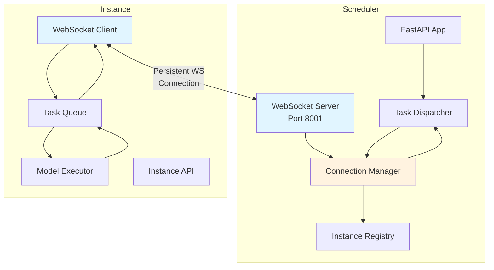
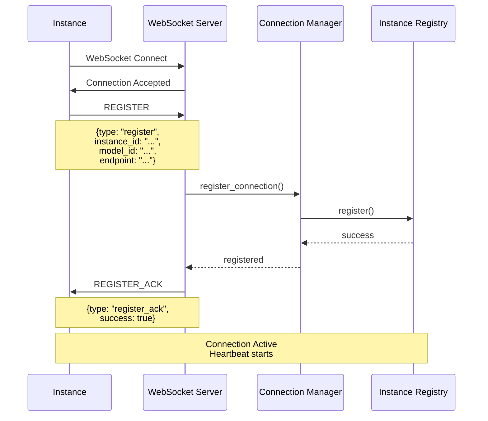
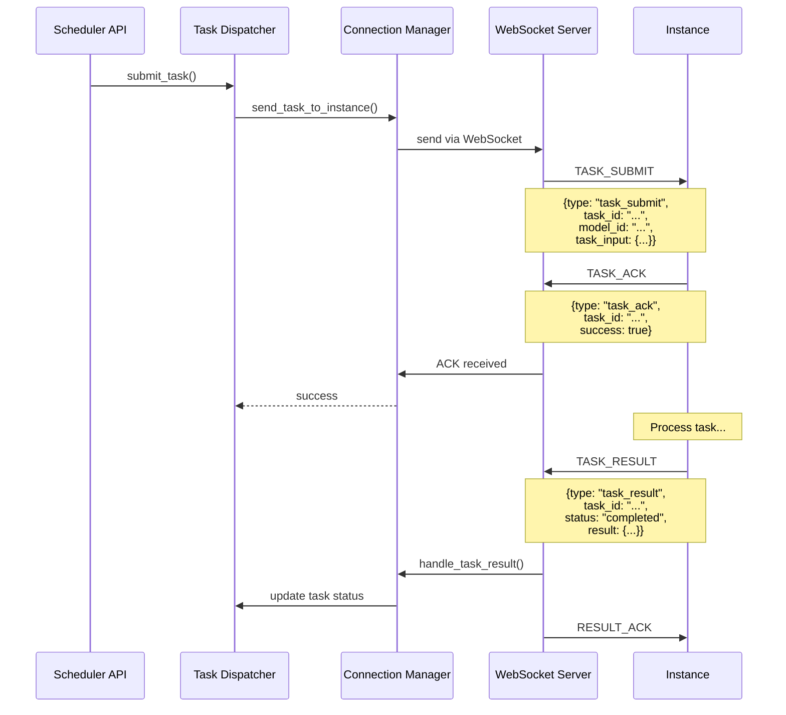
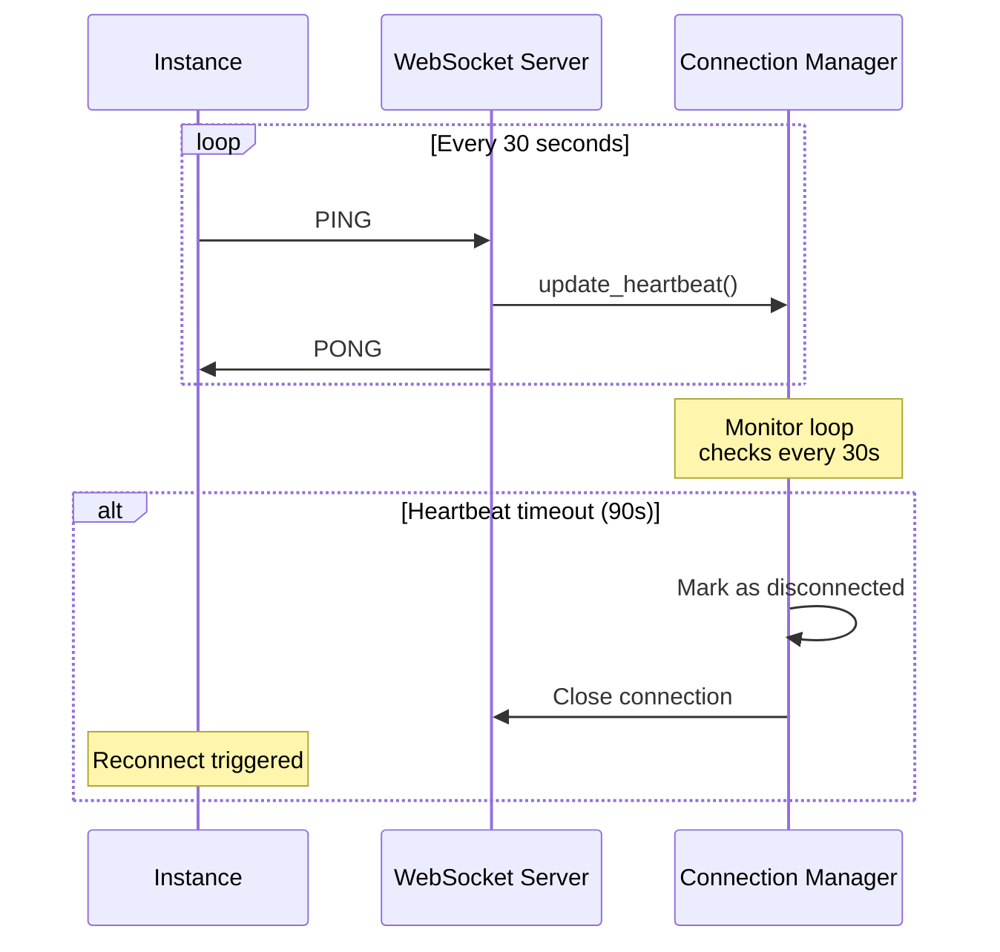
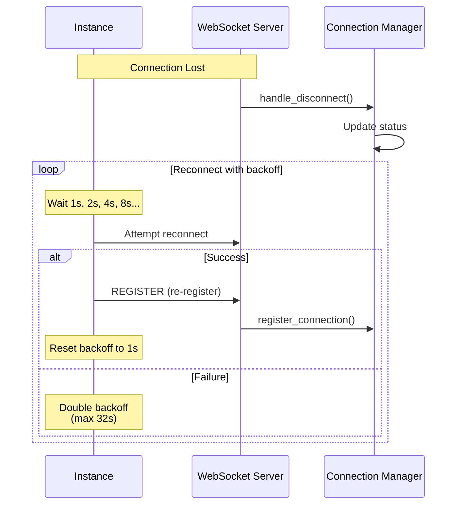
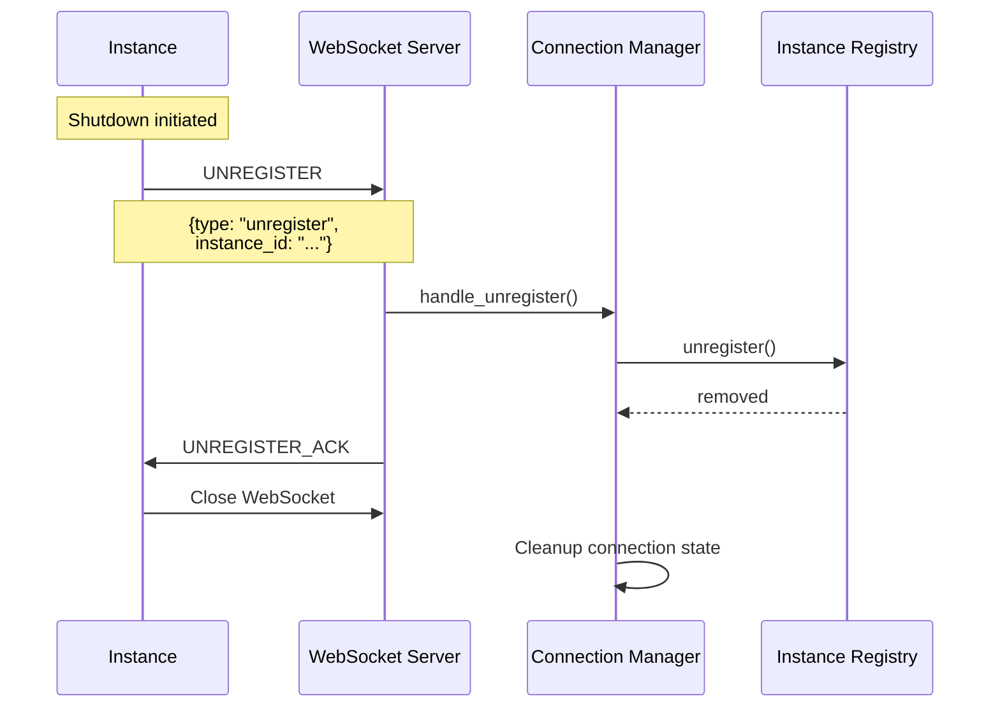
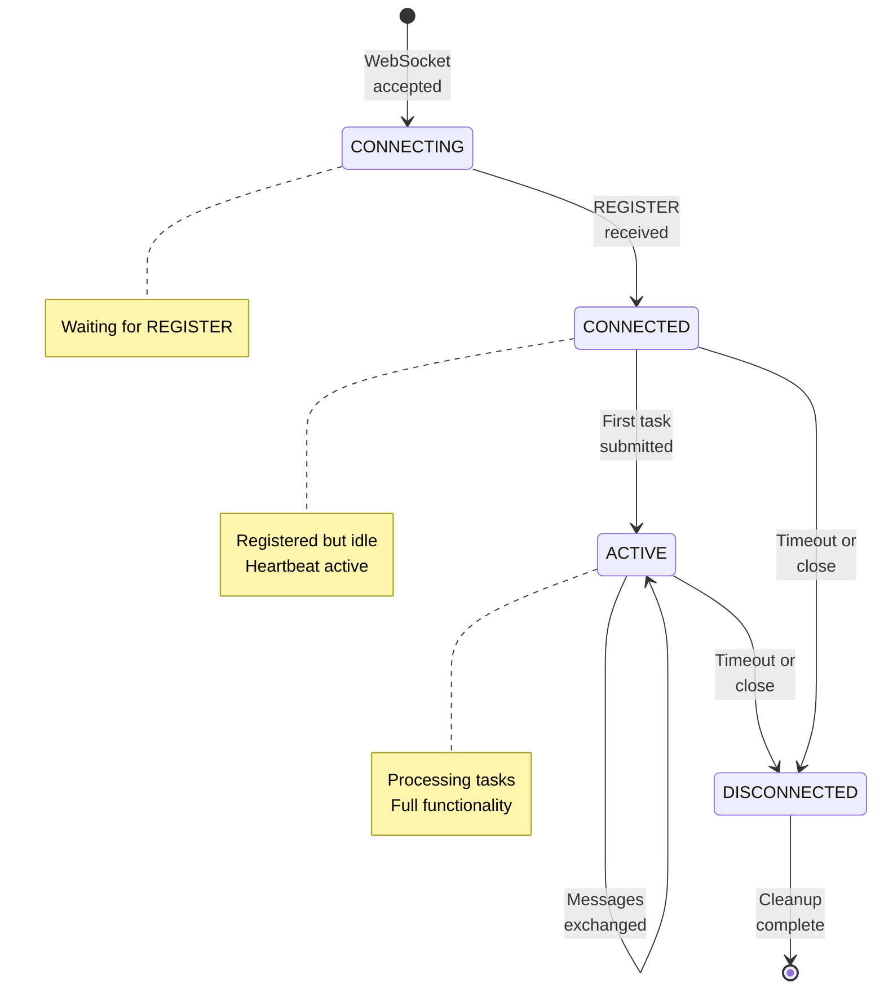
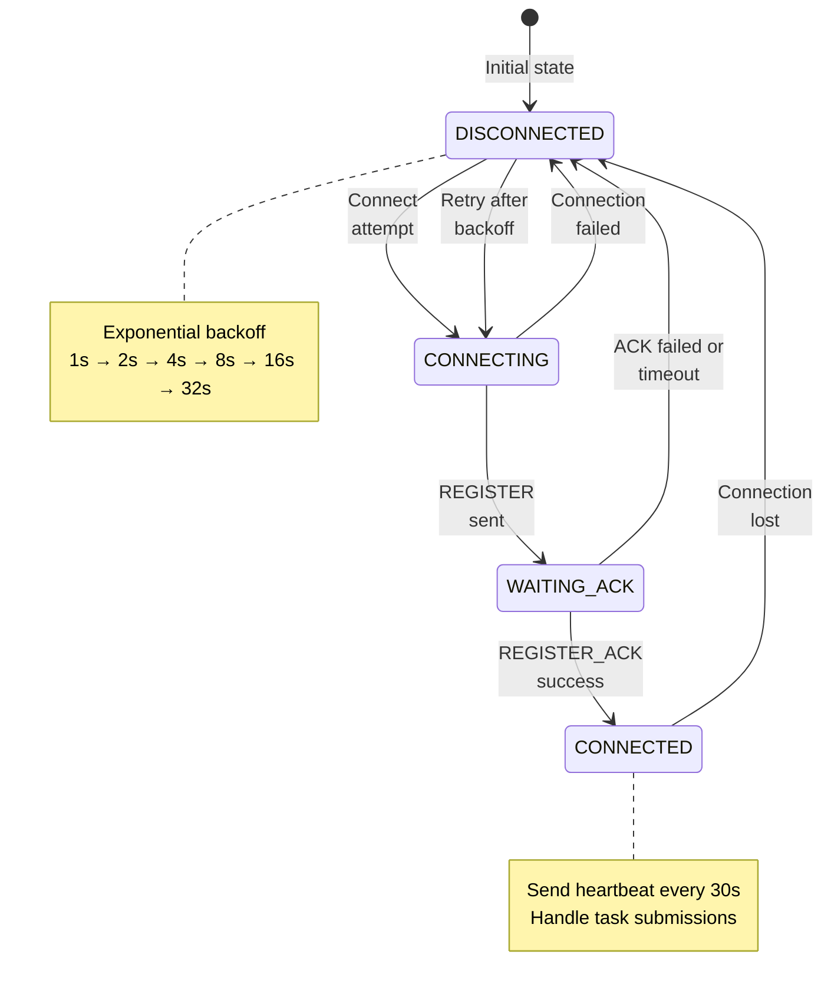

# WebSocket Architecture Documentation

## Overview

This document describes the WebSocket-based communication architecture between the Scheduler and Instance components. The WebSocket protocol replaces the traditional HTTP callback mechanism, providing persistent bidirectional communication with improved latency, throughput, and reliability.

## Architecture Diagram



## Component Responsibilities

### Scheduler Components

#### 1. InstanceWebSocketServer (`instance_websocket_server.py`)
**Port:** 8001 (configurable via `INSTANCE_WEBSOCKET_PORT`)

**Responsibilities:**
- Accept WebSocket connections from Instances
- Route incoming messages to appropriate handlers
- Handle REGISTER/UNREGISTER lifecycle
- Process TASK_RESULT messages
- Maintain PING/PONG heartbeat
- Send ACK responses

**Key Methods:**
```python
async def handle_client(websocket, path):
    """Handle a single WebSocket client connection"""

async def _handle_register(websocket, message):
    """Process Instance registration"""

async def _handle_task_result(websocket, message):
    """Process task completion results"""
```

#### 2. InstanceConnectionManager (`instance_connection_manager.py`)

**Responsibilities:**
- Maintain connection state for all Instances
- Track heartbeat timestamps (90s timeout)
- Manage ACK futures for message delivery confirmation
- Send tasks via WebSocket with retry logic
- Handle connection failures and cleanup
- Monitor connection health

**Key Data Structures:**
```python
@dataclass
class ConnectionInfo:
    instance_id: str
    websocket: WebSocket
    state: ConnectionState  # CONNECTING, CONNECTED, ACTIVE, DISCONNECTED
    connected_at: datetime
    last_heartbeat: datetime
    message_count: int
    error_count: int
    pending_acks: Dict[str, asyncio.Future]
```

**Key Methods:**
```python
async def send_message(instance_id, message, require_ack=True, timeout=10.0):
    """Send message and optionally wait for ACK"""

async def send_task_to_instance(instance_id, task_id, model_id, task_input):
    """Send task submission via WebSocket"""

async def _heartbeat_monitor():
    """Monitor heartbeats and disconnect stale connections"""
```

#### 3. TaskDispatcher (`task_dispatcher.py`)

**Responsibilities:**
- Choose submission method (WebSocket vs HTTP fallback)
- Implement retry logic with exponential backoff
- Log submission attempts and failures

**Key Methods:**
```python
async def _submit_via_websocket(instance_id, task_id, ...):
    """Submit task via WebSocket with retry"""

async def _submit_via_http(instance_id, task_id, ...):
    """HTTP fallback submission"""
```

### Instance Components

#### 1. WebSocketClient (`websocket_client.py`)

**Responsibilities:**
- Establish WebSocket connection to Scheduler
- Auto-reconnect with exponential backoff (1s→32s max)
- Send REGISTER on connection
- Handle incoming TASK_SUBMIT messages
- Route messages to registered handlers
- Send TASK_RESULT back to Scheduler
- Maintain heartbeat (PING every 30s)

**Key Methods:**
```python
async def _connection_loop():
    """Main connection loop with auto-reconnect"""

async def send_task_result(task_id, status, result, error, execution_time_ms):
    """Send task result to Scheduler"""

def register_handler(message_type, handler):
    """Register callback for message type"""
```

#### 2. WebSocketClientSingleton (`websocket_client_singleton.py`)

**Responsibilities:**
- Provide global access to WebSocket client
- Ensure single client instance per process

**Usage:**
```python
from src.websocket_client_singleton import get_websocket_client, set_websocket_client

# Get client
ws_client = get_websocket_client()
if ws_client and ws_client.is_connected():
    await ws_client.send_message(...)
```

## Connection Lifecycle

### 1. Initial Connection



### 2. Task Submission



### 3. Heartbeat Mechanism



### 4. Disconnection & Reconnection



### 5. Graceful Shutdown



## State Machines

### Connection State (Scheduler Perspective)



### Client Connection State (Instance Perspective)



## Message Flow Patterns

### Pattern 1: Fire-and-Forget
Used for: PING, PONG, UNREGISTER

```
Instance → Scheduler: MESSAGE
No ACK required
```

### Pattern 2: Request-Response with ACK
Used for: REGISTER, TASK_SUBMIT, TASK_RESULT

```
Instance → Scheduler: MESSAGE {message_id: "..."}
Scheduler → Instance: ACK {reply_to: "message_id"}
```

With timeout handling:
```python
# Send with ACK requirement
ack_future = asyncio.Future()
pending_acks[message_id] = ack_future

await websocket.send(json.dumps(message))

# Wait for ACK with timeout
try:
    ack_data = await asyncio.wait_for(ack_future, timeout=10.0)
except asyncio.TimeoutError:
    # Handle timeout - retry or fail
```

## Error Handling

### Connection Errors

| Error Type | Detection | Recovery |
|------------|-----------|----------|
| Network disconnect | WebSocket close event | Auto-reconnect with backoff |
| Heartbeat timeout | Last heartbeat > 90s | Server closes connection, Instance reconnects |
| Registration failure | REGISTER_ACK success=false | Instance retries with backoff |
| Message send failure | WebSocket exception | Retry up to 3 times, then HTTP fallback |

### Message Errors

| Error Type | Handling |
|------------|----------|
| Malformed JSON | Log error, send ERROR response |
| Missing required fields | Send NACK with error details |
| Unknown message type | Log warning, send ERROR response |
| Task not found | Send RESULT_ACK with error |

### Timeout Handling

```python
# Message ACK timeout (10s default)
try:
    ack = await asyncio.wait_for(ack_future, timeout=10.0)
except asyncio.TimeoutError:
    logger.warning(f"ACK timeout for message {message_id}")
    # Retry or fallback

# Heartbeat timeout (90s = 3 missed heartbeats)
if time.time() - connection.last_heartbeat > 90:
    await handle_disconnect(connection)
```

## Configuration

### Scheduler Configuration (`scheduler/src/config.py`)

```python
@dataclass
class WebSocketConfig:
    # Server settings
    instance_port: int = 8001
    instance_host: str = "0.0.0.0"

    # Heartbeat settings
    heartbeat_interval: int = 30  # seconds
    heartbeat_timeout_threshold: int = 3  # missed heartbeats

    # Message settings
    ack_timeout: float = 10.0  # seconds
    max_message_size: int = 16 * 1024 * 1024  # 16MB

    # Connection settings
    max_connections: int = 1000
    connection_timeout: int = 300  # 5 minutes idle
```

### Instance Configuration

```python
# WebSocket client settings
SCHEDULER_WS_URL = os.getenv("SCHEDULER_WS_URL", "ws://localhost:8001/instance/ws")
INSTANCE_ID = os.getenv("INSTANCE_ID", "instance-001")

# Reconnection settings
RECONNECT_DELAY_MAX = 32  # seconds
HEARTBEAT_INTERVAL = 30  # seconds
```

## Performance Characteristics

### Latency

| Metric | WebSocket | HTTP (Previous) | Improvement |
|--------|-----------|-----------------|-------------|
| Connection overhead | 0ms (persistent) | ~50-100ms per request | ~50-100ms saved |
| Message latency (P50) | 5-10ms | 50-80ms | 5-8x faster |
| Message latency (P95) | 15-25ms | 100-150ms | 5-6x faster |

### Throughput

| Metric | Value |
|--------|-------|
| Max concurrent connections | 1,000+ |
| Messages per second per connection | 100+ |
| Total system throughput | 10,000+ msg/s |

### Resource Usage

| Resource | WebSocket | HTTP |
|----------|-----------|------|
| Memory per connection | ~100KB | ~50KB per request |
| CPU overhead | Low (persistent) | Medium (per-request) |
| Network overhead | Minimal (binary frames) | Higher (HTTP headers) |

## Security Considerations

### Current Implementation

- WebSocket connections are **not encrypted** (ws://)
- No authentication beyond instance_id
- Message validation on both ends

### Production Recommendations

1. **Use WSS (WebSocket Secure)**
   ```python
   # Enable TLS
   ssl_context = ssl.create_default_context(ssl.Purpose.CLIENT_AUTH)
   ssl_context.load_cert_chain('cert.pem', 'key.pem')
   ```

2. **Add Authentication**
   ```python
   # Token-based auth in REGISTER message
   message = {
       "type": "register",
       "instance_id": "...",
       "auth_token": "...",  # JWT or similar
   }
   ```

3. **Rate Limiting**
   ```python
   # Per-connection message rate limiting
   if connection.message_count > MAX_MESSAGES_PER_MINUTE:
       await disconnect_with_error("rate_limit_exceeded")
   ```

4. **Input Validation**
   - Already implemented: JSON schema validation
   - Message size limits (16MB default)
   - Field presence and type checking

## Monitoring & Observability

### Key Metrics to Monitor

1. **Connection Metrics**
   - Active connections count
   - Connection establishment rate
   - Connection failure rate
   - Average connection duration

2. **Message Metrics**
   - Messages sent/received per second
   - Message latency (P50, P95, P99)
   - ACK timeout rate
   - Retry rate

3. **Error Metrics**
   - Heartbeat timeouts
   - Malformed messages
   - Registration failures
   - Task submission failures

### Logging

```python
# Connection lifecycle
logger.info(f"Instance {instance_id} connected from {remote_address}")
logger.info(f"Instance {instance_id} registered with model {model_id}")
logger.warning(f"Instance {instance_id} heartbeat timeout")

# Message processing
logger.debug(f"Sent TASK_SUBMIT to {instance_id}: {task_id}")
logger.debug(f"Received TASK_RESULT from {instance_id}: {task_id}")

# Errors
logger.error(f"Failed to send message to {instance_id}: {error}")
```

### Health Checks

```python
# Scheduler health endpoint
GET /health
Response: {
    "status": "healthy",
    "websocket_server": {
        "active_connections": 42,
        "total_messages": 15847,
        "uptime_seconds": 86400
    }
}

# Instance health endpoint
GET /info
Response: {
    "websocket": {
        "connected": true,
        "reconnect_count": 2,
        "message_count": 1234
    }
}
```

## Testing Strategy

### Unit Tests
- Message handler logic
- Connection state transitions
- ACK/timeout handling
- Reconnection backoff

### Integration Tests
- End-to-end task workflow
- Connection failures and recovery
- Multiple concurrent instances
- High throughput scenarios

### Performance Tests
- Latency benchmarks
- Throughput benchmarks
- Memory usage under load
- Sustained load testing

See `benchmarks/websocket_performance.py` for details.

## Troubleshooting

See [WEBSOCKET_TROUBLESHOOTING.md](../../docs/WEBSOCKET_TROUBLESHOOTING.md) for detailed troubleshooting guide.

## Migration Guide

See [WEBSOCKET_MIGRATION_GUIDE.md](../../docs/WEBSOCKET_MIGRATION_GUIDE.md) for migration instructions.

## References

- [Instance WebSocket Protocol Specification](INSTANCE_WEBSOCKET_PROTOCOL.md)
- [WebSocket API Reference](7.WEBSOCKET_API.md)
- WebSocket RFC: https://tools.ietf.org/html/rfc6455
- Python websockets library: https://websockets.readthedocs.io/
